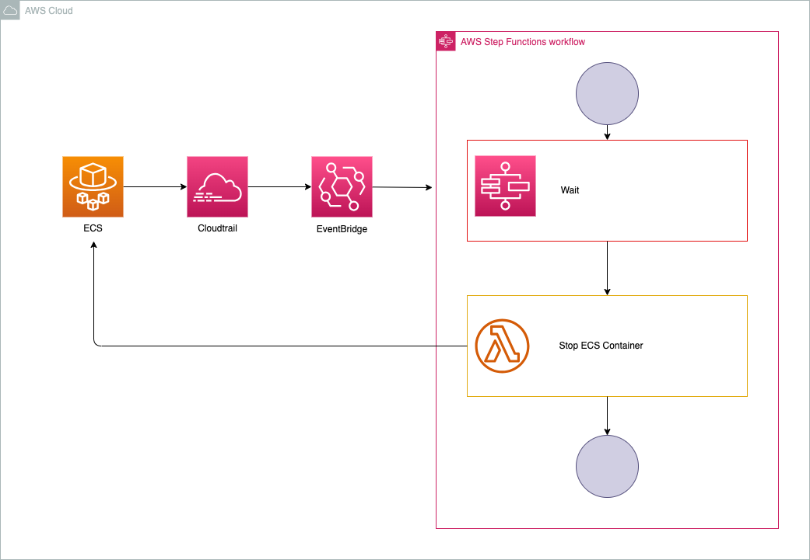

# Step Functionsを使ったECSコンテナの制御

<p align="center">
  
</p>


[](https://www.docker.com/)


# 概要

このプロジェクトは、AWS Step Functionsを使用してECSコンテナを開始し、10秒後に停止させる自動化プロセスを実装します。主要なAWSサービスとして、IAM、ECR、CloudTrail、EventBridge、Step Functions、Lambdaを使用します。

# 機能一覧
+ **ECSコンテナの開始と停止**: Step Functionsを使用してECSコンテナを開始し、10秒後に自動的に停止させます。
+ **インフラ管理**: IAM、ECR、CloudTrail、EventBridge、Step Functions、Lambdaを利用したインフラ構成。
+ **ログとトラッキング**: CloudTrailを使用して操作の監査ログを取得し、EventBridgeでイベントをトリガーします。

# インフラ構成
+ **IAM**: IAMポリシーとロールを設定し、Step FunctionsとLambdaが必要な権限を持つようにします。
+ **ECR**: ECSで使用するコンテナイメージを格納するためのリポジトリを設定します。
+ **ECS**: コンテナの実行環境としてECSクラスターを設定します。
+ **CloudTrail**: すべてのAPIコールを監査し、セキュリティとコンプライアンスを強化します。
+ **EventBridge**: 特定のイベントをトリガーし、Step Functionsを起動します。
+ **Step Function**s: ECSコンテナの開始と停止を管理するステートマシンを設定します。
+ **Lambda**: Step Functionsのタスクとして使用され、コンテナの停止を実行します。

# 起動とデプロイ方法

以下のコードを実行してインフラを構築します。
```
bin/terraform_apply
```

# 停止
以下のコードを実行すると停止できます。
```
bin/terraform_destroy
```

# まとめ
このREADMEでは、Step Functionsを使用してECSコンテナを制御する方法について説明しました。これにより、インフラの自動化が容易になり、効率的なコンテナ管理が可能になります。詳細な設定手順については、各サービスのドキュメントを参照してください。

# Qiita記事

技術詳細はQiitaに記載しています。

[Step Functionsを使ったECSコンテナの制御](https://qiita.com/sugiyama404/items/4fcc7fd3550ac1137906)
